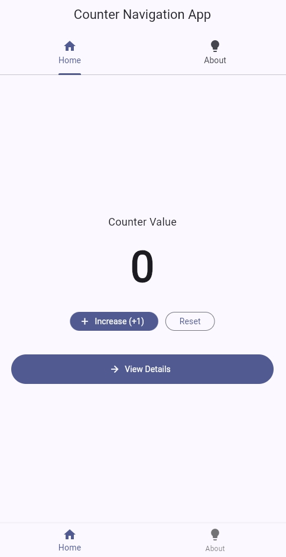
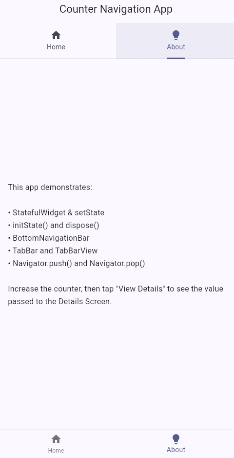
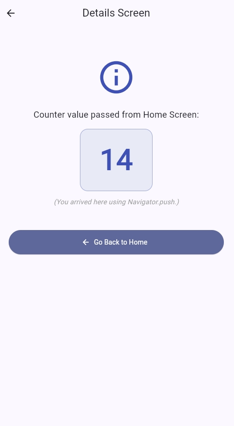

# Counter Navigation App (Assignment on Module 13)

A simple, beginner-friendly Flutter app with two screens.

## Screens

| Screen | Route | Purpose |
| ------ | ----- | ------- |
| **Home Screen** | `HomeScreen` (launch) | Increase / reset a counter, switch tabs, and push the Details Screen. |
| **Details Screen** | `DetailsScreen` | Receives the counter value passed from Home and shows it. |

##  App Screenshots

###  Home Screen
Displays the counter value with buttons to increase, reset, and navigate to the details page.


###  About Screen
Explains the app’s purpose and demonstrates Flutter concepts like `StatefulWidget`, `BottomNavigationBar`, and navigation methods.


### ️ Details Screen
Shows the counter value passed from the Home Screen using `Navigator.push()`.


## How it works

1. Tap **Increase (+1)** on the Home tab — the counter is updated with `setState()`.
2. Tap **View Details** — `Navigator.push()` opens the Details Screen and passes the current counter value.
3. On the Details Screen the passed value is displayed. Tap **Go Back to Home** to return with `Navigator.pop()`.
4. The **TabBar** (top) and the **BottomNavigationBar** (bottom) both switch between the *Home* and *About* tabs; they stay in sync through a shared `TabController`.

## Flutter concepts covered

- `StatefulWidget` and `State` classes
- `initState()` — creates the `TabController`
- `dispose()` — releases the `TabController` and a `ScrollController`
- `setState()` — rebuilds the UI when the counter changes
- `Navigator.push()` / `Navigator.pop()`
- `BottomNavigationBar`
- `TabBar` + `TabBarView` (+ `TabController`)

## Run

```bash
flutter pub get
flutter run
```

## Test

```bash
flutter test
```
