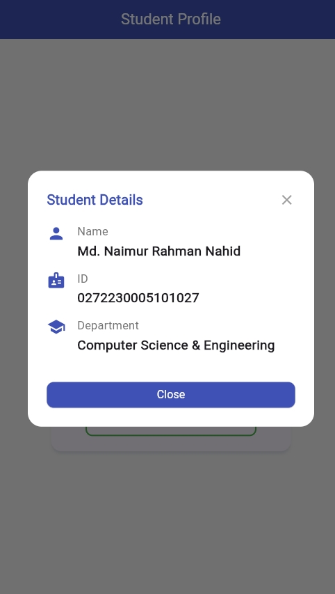

# Student Profile Card App (Assignment on Module 14)

A simple, clean Flutter app that displays a **Student Profile Card** using
responsive design, a shimmer loading effect, a custom dialog, and a custom
SnackBar.


*The shimmer loading placeholder displayed for the first 3 seconds after launch.*


*The profile card screen showing the student avatar with "New" badge, student information, and action buttons (View Details & Mark Present).*

## Features

| Feature               | Package / Widget         | Details                                              |
| --------------------- | ------------------------ | ---------------------------------------------------- |
| Responsive sizing     | `flutter_screenutil`     | All dimensions adapt to screen size via `.w/.h/.r/.sp` |
| Shimmer loading       | `shimmer`                | 3-second animated placeholder shown on launch        |
| Profile card          | `Card`                   | Name, ID, department, avatar, and "New" badge        |
| Avatar                | `CircleAvatar`           | Icon-based (swap for `AssetImage` if desired)        |
| "New" badge           | `Stack` + `Container`    | Positioned in the top-right corner of the avatar      |
| View Details dialog   | `Dialog`                 | Custom-styled dialog showing name, ID, and department |
| Mark Present          | `SnackBar`               | Floating success Snackbar with an icon                 |

## How it works

1. **Launch** — A shimmer placeholder is displayed for ~3 seconds.
2. **After loading** — A profile card fades in showing:
   - A `CircleAvatar` with a **"New"** badge in the corner
   - Student name, ID, and department text
   - Two buttons: **View Details** and **Mark Present**
3. **View Details** — Opens a custom dialog with the same student info.
4. **Mark Present** — Displays a success `SnackBar`.

## Run

```bash
cd Assignment_on_Module_14
flutter pub get
flutter run
```
